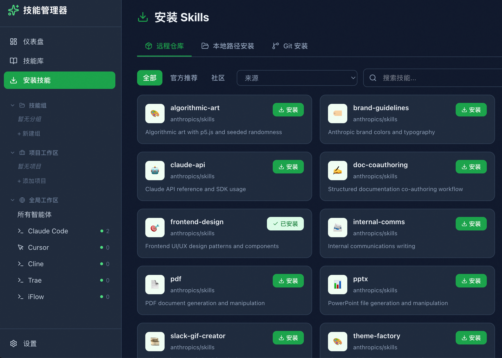

# SKM — AI Agent Skills Manager

[中文文档](README_CN.md)

A unified skills management tool for AI coding agents. Single Go binary provides both CLI and web UI.



## Features

- **Multi-agent support** — Claude Code, Cursor, Codex (extensible)
- **Skill groups** — Batch install/manage collections of skills
- **Dual scope** — Global (`~/.agent/skills/`) and project-level (`.agent/skills/`)
- **Web UI** — React dashboard embedded in the binary
- **Symlink sync** — Central library with symlink deployment (copy fallback)
- **Multiple sources** — GitHub URLs, shorthand (`owner/repo`), local directories

## Install

```bash
go install github.com/wujiyu115/skm/cmd/skm@latest
```

Or build from source:

```bash
make build
```

## Quick Start

```bash
# Install a skill from GitHub
skm install owner/repo -a claude -g

# List installed skills
skm list

# Sync all skills to detected agents
skm sync

# Create and use groups
skm group create frontend
skm group add frontend my-skill another-skill
skm group install frontend -a claude

# Start web UI
skm serve --open
```

## CLI Commands

| Command | Description |
|---------|-------------|
| `skm install <source>` | Install skill from GitHub or local path |
| `skm list` | List installed skills |
| `skm show <skill>` | Show skill details and content |
| `skm remove <skill>` | Remove a skill |
| `skm enable/disable <skill>` | Enable or disable a skill |
| `skm sync` | Sync all enabled skills to agents |
| `skm sync status` | Show sync status (synced/stale/unsynced) |
| `skm unsync <skill> -a <agent>` | Unsync a skill from specific agent(s) |
| `skm update [skill\|--all]` | Update git-sourced skills |
| `skm search <query>` | Search skills by name, description, or tag |
| `skm batch delete\|enable\|disable\|tag\|sync` | Batch operations on multiple skills |
| `skm group create\|list\|show\|add\|remove\|install\|update\|delete` | Manage skill groups |
| `skm tag list\|add\|remove\|rename\|delete` | Manage skill tags |
| `skm agent list\|add\|remove\|skills\|add-skill\|remove-skill` | Manage agents and their skills |
| `skm project add\|list\|remove\|scan` | Manage project workspaces |
| `skm audit list\|prune` | View and manage audit log |
| `skm config list\|get\|set` | Manage settings |
| `skm export` | Export skill library as JSON |
| `skm info` | Show diagnostics |
| `skm serve` | Start web UI (default :3721) |
| `skm version` | Show version info |

## Source Formats

```
https://github.com/owner/repo/tree/branch/path  # GitHub tree URL
https://github.com/owner/repo                    # GitHub repo
owner/repo/subpath                               # Shorthand with subpath
owner/repo                                       # Shorthand
./local/path                                     # Local directory
```

## Skill Format

A skill is a directory containing a `SKILL.md` with YAML frontmatter:

```markdown
---
name: my-skill
description: What this skill does
metadata:
  type: coding
  tags: [react, frontend]
---

# Instructions for the AI agent
```

## Architecture

```
~/.skm/
├── skills/          # Central skill library
├── skm.db           # SQLite index
├── .metadata/       # JSON mirror (git-backupable)
└── cache/           # Clone cache
```

- **Go** — Cobra CLI, Fiber HTTP, pure-Go SQLite (modernc.org/sqlite)
- **Frontend** — React 19, Vite, Tailwind CSS v4, embedded via `go:embed`
- **Sync** — Symlink-first with copy fallback, SHA-256 freshness checks

## Development

```bash
# Terminal 1: Vite dev server with HMR
cd web && npm run dev

# Terminal 2: Go server proxying to Vite
SKM_DEV=1 go run ./cmd/skm serve

# Run tests
make test
```

## License

MIT
